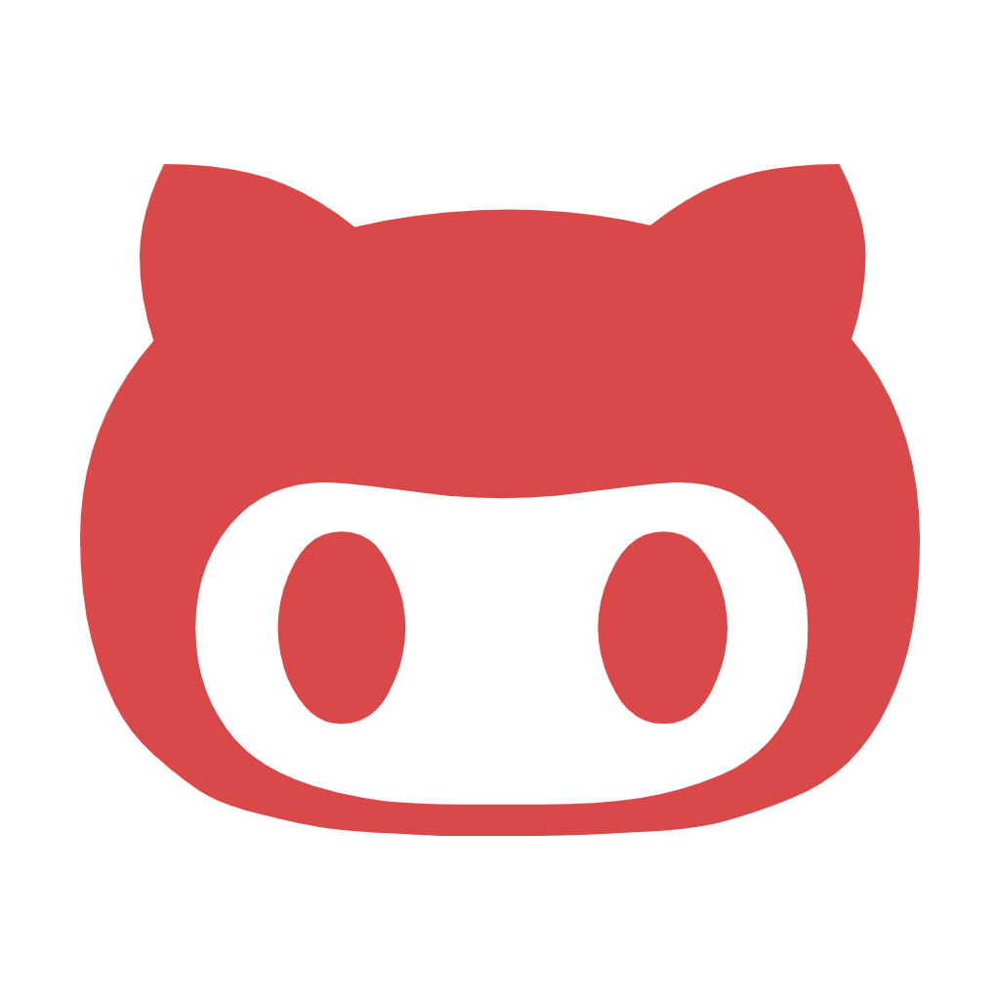

<div align="center">
<p>

</p>

🔥 __Github Battle__ is a React App that pulls data  from the [Github API](https://developer.github.com/v3/) to achieve multiple actions like Github Users Battle and Most Popular Repos.

This app is the final result of Tyler McGinnis' course which can be found [here](https://learn.tylermcginnis.com).

<p><a href="https://nervous-babbage-5197ea.netlify.com/" class="btn btn-primary btn-md">Launch App</a></p>
</div>

## Features

* ⚒️ __Simple__: Bootstrapped with [Create React App](https://github.com/facebookincubator/create-react-app) and using [React](https://facebook.github.io/react/)

* 📊 __Real-time__: Data obtained from the [Github API](https://developer.github.com/v3/)

* 📱 __Responsive__: Made mobile responsive with Flexbox

* 🔥 __Live__: Deployed with [Netlify](https://www.netlify.com/)

## Usage

Fork or download this repo , move inside and run:

```javascript
npm install
npm start
```

Open development build on [http://localhost:3000/](http://localhost:3000/)

To deploy it:

```javascript
npm build
```
